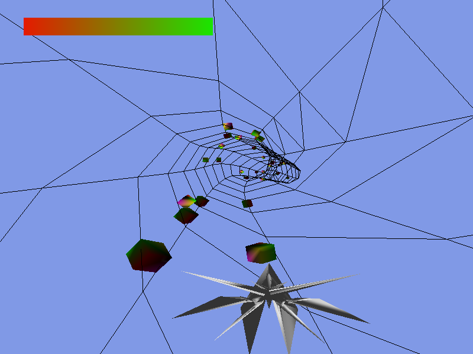

# Perlin Vertex

Projet de jeu pour le module de Synthèse d'image avec [OpenGL](https://www.opengl.org/).



## Installation

**Compiler** les fichiers depuis le *répertoire* contenant le fichier `main.cpp` :
```sh
$ make
```

## Utilisation

Pour **lancer** le jeu, exécuter la commande suivante :
```sh
$ ./executable
```

---
## Objectif

**Survivre** le plus longtemps possible en **évitant les obstacles** qui bloquent le chemin.

**Attention :** il n'y a que **8 vies** disponibles.


## Commandes

Le jeu se joue uniquement avec les **flèches du clavier** :
- **Gauche :** Tourne le vaisseau à gauche.
- **Droite :** Tourne le vaisseau à droite.
- **Haut :** Accélère.
- **Bas :** Ralentit.


## Attention

Lorsque tous les **points de vie** ont été utilisés : le jeu se ferme *brutalement*.

---
## Problèmes

Si un *problème* apparaît durant la **compilation** : pas de panique !
- Bien **supprimer** tous les fichiers `.o` dans tous les *sous-répertoires* (et vérifier même après un `$ make clean`)
- Le programme a été testé avec l'installation des **packages** suivants : `make`, `g++`, `libglew-dev`, `freeglut3-dev`. Veuillez les installer si ce n'est pas déjà fait.